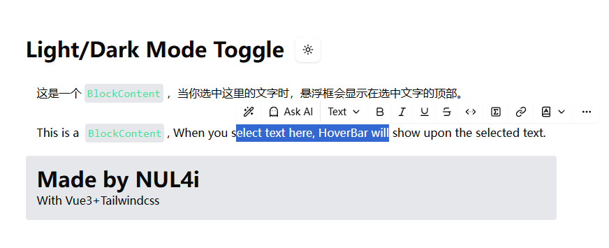

# [WIP] Notion UI with Vue3

This is a side project of my learning & experienment in Vue3.

So far, Hover Bar is done in MVP development:

Next will be dynamic `markdown` render, Block management, data structure design and complex markder parser.
