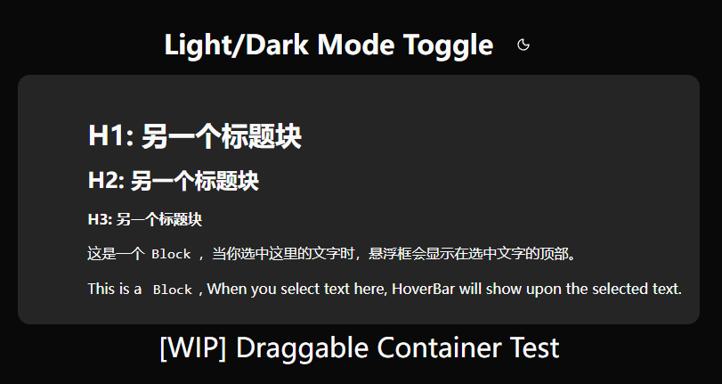

# [WIP] Notion UI with Vue3

This is a side project of my learning & experienment in Vue3.

So far, Hover Bar is done in MVP development:

Next will be dynamic `markdown` render, Block management, data structure design and complex markder parser.

Some of the code is from [Lotion](https://lotion.dashibase.com/), and I will try to follow their design as closely as possible.

## structure

Block should be re-written. Add/Delete logic should be written in ts.